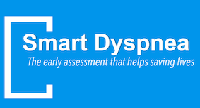
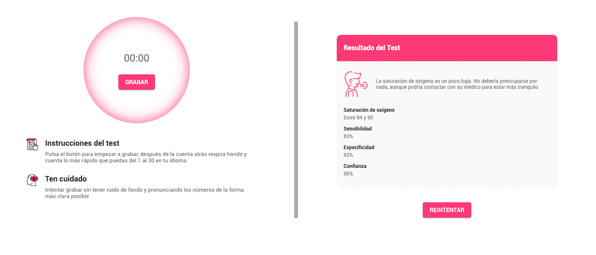
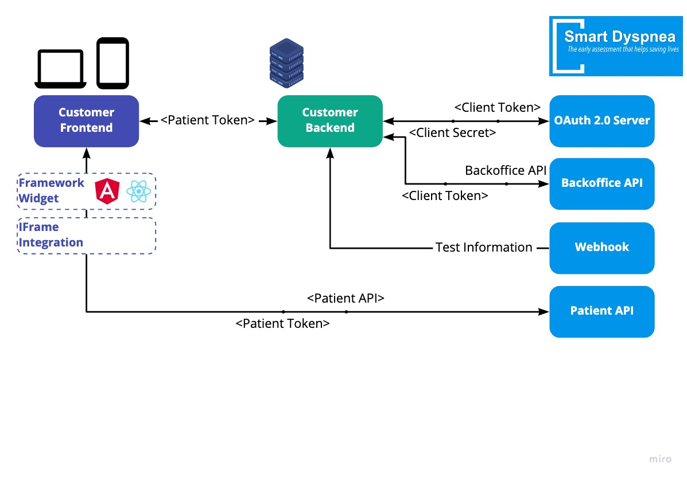

# Integration instructions

This documents describes a comprehensive guide to integrate the [AI-Powered SmartDyspnea Oxygen Saturation Test](https://smartdyspnea.com) widget.

## Prerequisites

If planning a production integration:

- Contact sales team to acquire an API Key
- A server-rendered or and SPA+API application

## Architecture & DataFlow

Integrating the SmartDyspnea client requires both a backend and frontend integration, a brief introduction to our data flow is as follows:

- Backend application authenticates with our OAuth 2.0 server using the provided client credentials and obtains a `client_token`
- Backend can then perform __backoffice API calls__
    - Register/Deleting a patient
    - Retrieving a `patient_token`
    - Obtaining Reports
- Backend can provide the customer facing frontend application with a `patient_token`
- Frontend can integrate the SmartDyspnea widget using the `patient_token`
- The customer (patient) can then perform tests and send data to SmartDyspnea services

__Important:__ Never expose your `client_token` to end users

## API Docs

The following document describes

## Frontend Widget

We provide different ways to add our widget to your frontend application. We recommend integrating the native widget for your framework whenever possible.

- Framework widgets
  - [Angular widgets](./angular-widgets/README.md)
  - React widgets: Coming soon
- [IFrame integration](./iframe-integration/)

## Webhooks

> Coming soon