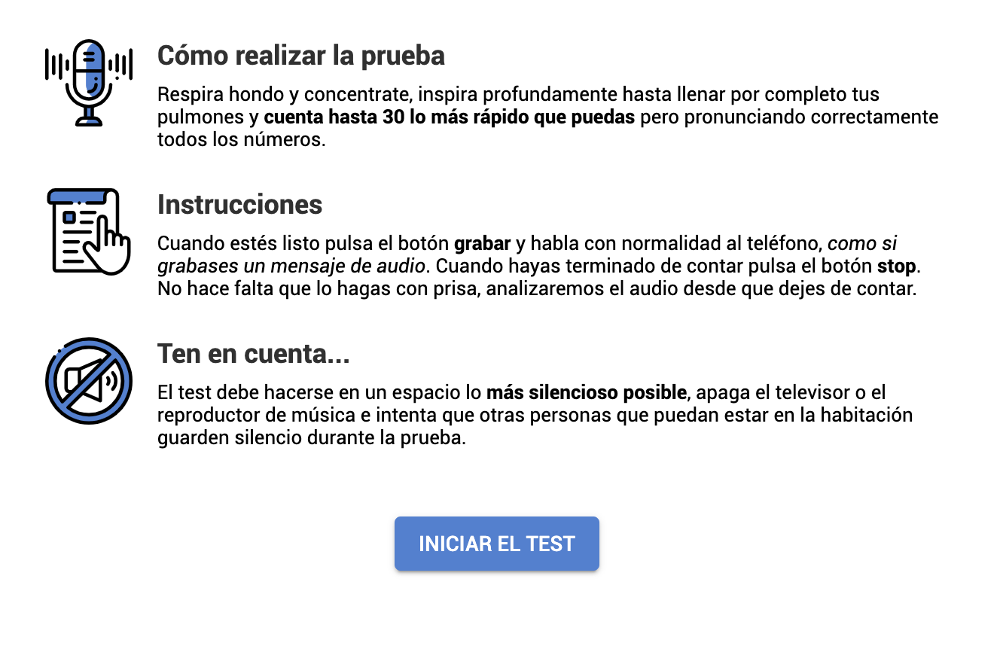
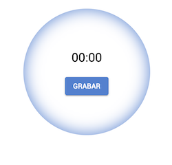
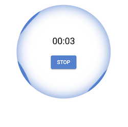
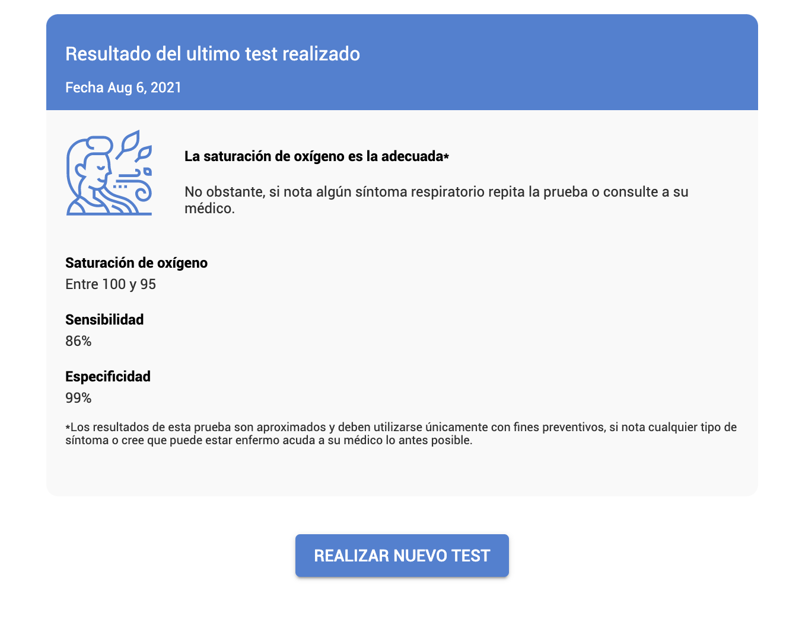
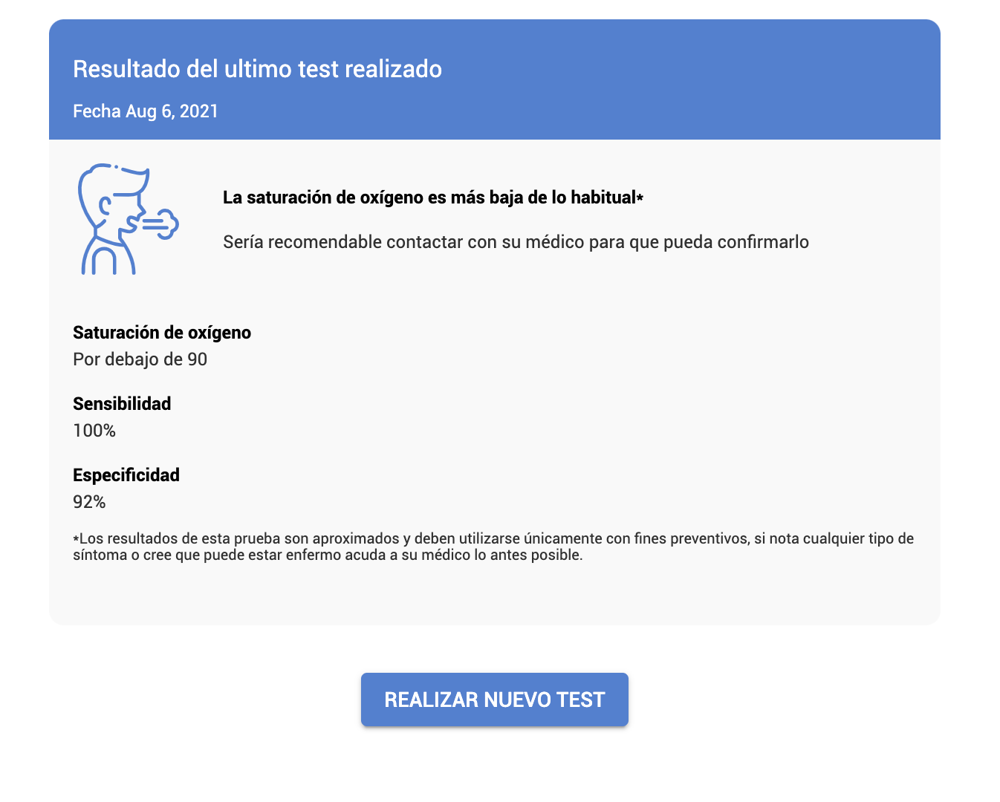

# Integration instructions

This documents describes a comprehensive guide to integrate the [AI-Powered SmartDyspnea Oxygen Saturation Test](https://smartdyspnea.com) widget.

## Prerequisites

If planning a production integration:

- Contact sales team to acquire an API Key, and setup your webhook endpoint.
- A server-rendered or and SPA+API application
- You can however test the web component/iframe by using a stub deployment.

## Architecture & DataFlow

Integrating the SmartDyspnea client requires both a backend and frontend integration, a brief introduction to our data flow is as follows:

- Backend application authenticates with our OAuth 2.0 server using the provided client credentials and obtains a `client_token`
- Backend can then perform __backoffice API calls__
    - Register/Deleting a patient
    - Retrieving a `patient_token`
    - Obtaining Reports
- Backend can provide the customer facing frontend application with a `patient_token`
- Frontend can integrate the SmartDyspnea widget using the `patient_token`
- The customer (patient) can then perform tests and send data to SmartDyspnea services
- Our system will notify each successful test using a webhook connection.

__Important:__ Never expose your `client_token` to end users

## API Docs

OpenAPI docs can be accessed at: [https://docs.smartdyspnea.com](https://docs.smartdyspnea.com)

We provide a [step-by-step guide with integration examples](./api/)

## Frontend Widget

We provide different ways to add our widget to your frontend application. We recommend integrating the native widget for your framework whenever possible.

- Framework widgets
  - [Angular widgets](./angular-widgets/)
  - React widgets: Coming soon
- [IFrame integration](./iframe-integration/)

## Webhooks

The algorithms that power our tests run asynchronously. Our widgets are impllemented to listen to the internal status and render the results when available, however you can get notified via webhook when a test has finished.

- [Webhook Docs](./webhook/)

## Screenshots

