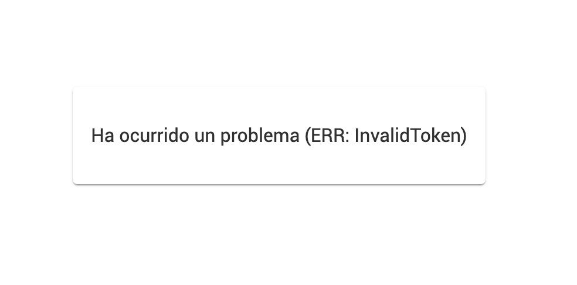

# SmartDyspnea - Angular widgets

We provide a native angular implementation of our audio respiratory test that can be easily installed from npm and integrated into an existing angular application.

## Installing from npm

Add the following dependency to your `package.json` file using your preferred dependency tool>

```
npm install @smart-dyspnea/angular-widgets
```

```
yarn add @smart-dyspnea/angular-widgets
```

### Dependencies

Install the following peer dependencies:

```
npm install recordrtc jwt-decode
```

```
yarn add recordrtc jwt-decode
```

## Usage

### Configuring your application

Import the `AngularWidgetsModule` module into your angular application, like in the following minimal example (make sure to include the `HttpClientModule` in your application):

```typescript
import { BrowserModule } from '@angular/platform-browser';
import { NgModule } from '@angular/core';

import { AppComponent } from './app.component';
import { HttpClientModule } from '@angular/common/http';
import { SmartDyspneaAngularWidgetsModule } from '@smart-dyspnea/angular-widgets';

@NgModule({
  declarations: [AppComponent],
  imports: [BrowserModule, HttpClientModule, SmartDyspneaAngularWidgetsModule],
  providers: [],
  bootstrap: [AppComponent],
})
export class AppModule {}
```

## Inserting the widget

The widget can receive a series of parameters in order to work or to customize its appearance.

### Authentication

\*\*Retrieve a `patient_token` for the signed-in user and pass it as an input to the component.

```html
<smartdyspnea-rothtest [token]="tokenValue"></smartdyspnea-rothtest>
```

\*\*Follow the [backend integration/API](../api/README.md) instructions in order to properly retrieve the `patient_token` using your server-side API. You should not call the API directly from your SPA application and it will expose your `client_credentials` to your end users.

If the token is missing or is invalid the widget will not render and will show an error message



### Mocking Authentication and services

If you just wan to test dependencies, aestetics or UX of the component you can bypass authentication by using the mock parameter. However your widget will not call our services and will return random results for the tests.

```html
<smartdyspnea-rothtest [mock]="mock"></smartdyspnea-rothtest>
```

### Accessing test results

You can access test result by binding to the `testResult` output in the component. This output emits the information of the last test when successfully loading the RESULTS step.

```html
<smartdyspnea-rothtest (testResult)="processTest($event)"></smartdyspnea-rothtest>
```

And then processing the test as intended

```typescript
  processTest(test: RothTest): void {
    // Do something with the test
  }
```

The `RothTest` interface can be imported in your typescript file as following

```typescript
import { RothTest } from '@smart-dyspnea/angular-widgets/lib/widgets/rothtest/models/rothtest';
```

And contains the following information, please refer to the API documentation for a comprehensive interpretation of the parameters.

```json
{
    "updated_at": "2021-08-06T15:44:28.069940",
    "created_at": "2021-08-06T15:44:22.978767",
    "status": "success",
    "test_result": {
        "code": "C01",
        "text": "100-95",
        "confidence": 0.99
    },
    "patient_id": "810299fa-1b4b-4b99-86c3-73ac9a3af96c",
    "test_id": "dfd076ac-2959-43dd-a019-9250f860b5af"
}
```

### Controlling views and navigation

The widget has three main screens:

- Instructions: Provides instructions on how too perform the test is just informative
- Record: This UI records the audio and sends it to our servers
- Results: This UI shows the information about the last performed test

You can chose which screens to show to the user depending on internal status, to this extent, the widget is multipurpose and can be used to post and review a test or just to review the latest test.

To control the sequence you can use the `step` parameter like this:

- Complete sequence

```html
<smartdyspnea-rothtest></smartdyspnea-rothtest>
```

- Skip instructions

```html
<smartdyspnea-rothtest [step]="'RECORD'"></smartdyspnea-rothtest>
```

- Just show results

```html
<smartdyspnea-rothtest [step]="'RESULTS'"></smartdyspnea-rothtest>
```

### Theming the widget

We offer several theming capabilities for the widget:

- `color`: A hex value that will change the primary color of the application
- `font`: A string value containing the name of one of the supported fonts
  - `Roboto`
  - `DM Sans`

Is there something missing you want to change? Talk to us or leave an issue in this repo.
